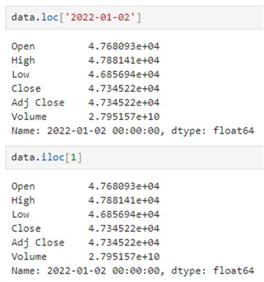
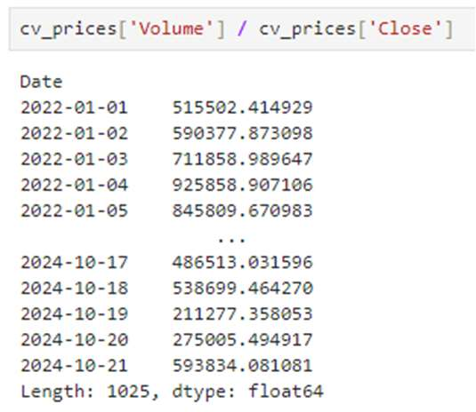
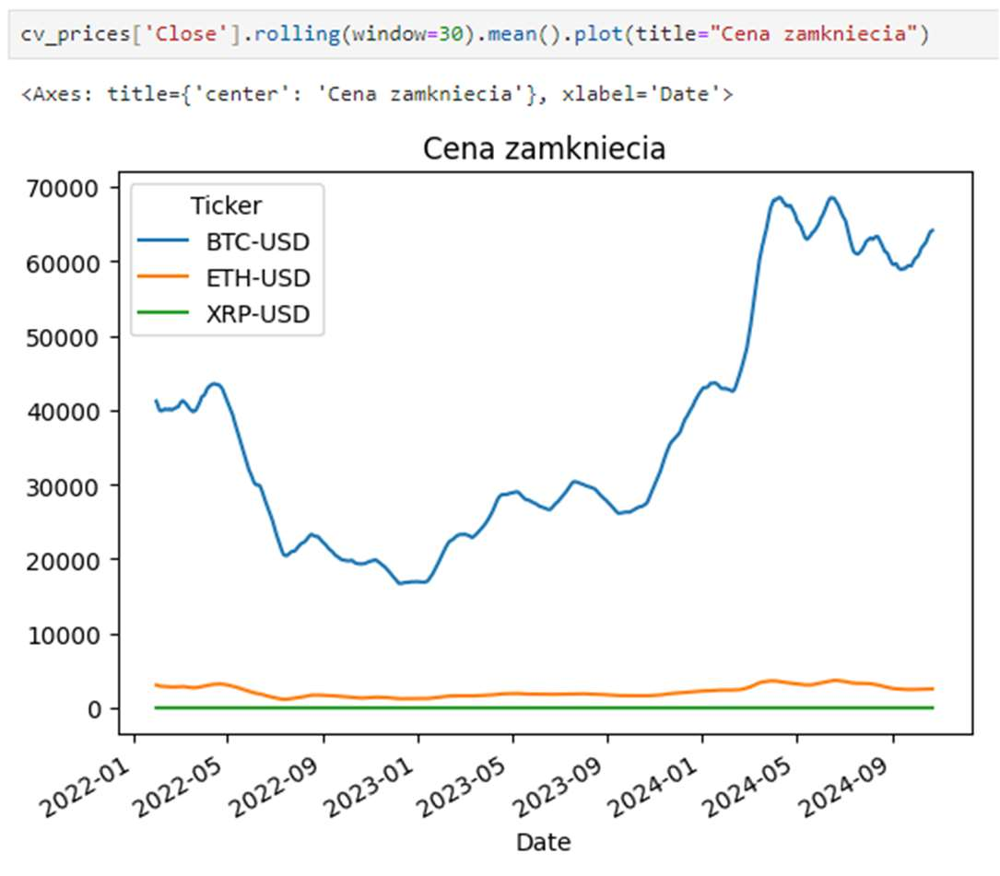

# Zestaw 3

## Zadanie 1

W pliku [tramwaje.json](zadanie_1/tramwaje.json) znajdują się dane z numerami linii tramwajowych w Krakowie oraz przystanków, przez które przejeżdża dany tramwaj (stan na 5.11.2023, ale to nie ma znaczenia). W języku Python, czytanie danych w formatach `.json` czy `.csv` jest wykonywane z pomocą modułów. W naszym przypadku:
```python
import json
with open('tramwaje.json', "r", encoding='utf-8') as read_file:
    data = json.load(read_file)
```

Wczytane dane (zróbmy `print`) są złożone z zagnieżdżonych typów: słownika, listy, słownika, listy:
```python
{'tramwaje': [{'linia': '1', 'przystanek': [{'nazwa': 'Wańkowicza 01'}, {'nazwa': 'Cienista 01'}, {'nazwa': 'Teatr Ludowy 01'}, ...}
```

Zatem, przykładowo, żeby odczytać pierwszy przystanek dla linii 1, trzeba wywołać w konsoli:
`data['tramwaje'][0]['przystanek'][0]['nazwa']` żeby zobaczyć nazwę 'Wańkowicza 01'.

Należy przepisać dane do uproszczonego formatu typu słownik, którego kluczem będzie numer linii tramwajowej (zapisany jako `int`), a wartością krotka zawierająca wszystkie nazwy przystanków danej linii.

*Uwaga*: technicznie przystanki oprócz nazw mają też numery, proszę uprościć dane, zapisując wyłącznie nazwy przystanków, bez końcowych numerów (01, 02...). Przykładowo, dla linii nr 1 spodziewany format danych wygląda następująco:
```javascript
{1: ('Wańkowicza', 'Cienista', 'Teatr Ludowy', 'Rondo Kocmyrzowskie im. Ks.
Gorzelanego', 'Bieńczycka', 'Rondo Czyżyńskie', 'Centralna', 'Rondo 308. Dywizjonu', 'M1 al. Pokoju', 'TAURON Arena Kraków al. Pokoju', 'Dąbie', 'Ofiar Dąbia', 'Fabryczna', 'Francesco Nullo', 'Teatr Variété', 'Rondo Grzegórzeckie', 'Hala Targowa', 'Starowiślna', 'Poczta Główna', 'Plac Wszystkich Świętych', 'Filharmonia', 'UJ / AST', 'Muzeum Narodowe', 'Oleandry', 'Park Jordana', 'Reymana')}
```

Proszę wynik konwersji zapisać do pliku wyjściowego (również w formacie .json), np. w ten sposób:
```python
with open('tramwaje_out.json', 'w', encoding='utf-8') as file:
    json.dump(trams, file, ensure_ascii=False)
```

Proszę wypisać na ekranie następujące informacje:
* numer linii – liczba przystanków, posortowane po liczbie przystanków w kolejności malejącej.

Na koniec wypisać również liczbę (nie nazwy) wszystkich przystanków obsługiwanych przez tramwaje (w tym celu należy znaleźć część wspólną krotek z nazwami przystanków, bo tramwaje często współdzielą ten sam przystanek).

**Wymagania formalne** Użyć plik `zadanie_1/zadanie1.py` w repozytorium GitHub Classroom do uzupełnienia swoim kodem. Funkcja `process_tram_data(input_file, output_file)`, jako pierwszy argument używa plik wejściowy (użyj 'tramwaje.json'), tworząc plik wyjściowy (użyj 'tramwaje_out.json'). *Ważne*: funkcja musi zwrócić obiekt słownik (linia – liczba przystanków) oraz całkowitą liczbę niepowtarzających się przystanków [zadanie za 1,5 pkt].

## Zadanie 2

Python jest naturalnym językiem do pozyskiwania danych, ich badania i wizualizacji. Celem tego zadania będzie zapoznanie się z bibliotekami `yfinance` i `pandas`. Pierwszy moduł dostarcza dane z notowań giełdowych
różnych walorów (z serwisu Yahoo Finance). Zainstalujmy: `yfinance`, `pandas`, `matplotlib`. Należy również zainstalować i uruchomić Jupyter Notebook (krótki opis można znaleźć w dokumencie „Python Notatki”), gdyż bardzo ułatwi to poznanie wybranych funkcji i danych. Obsługa Notebooka jest intuicyjna, uruchomienie pola z kodem to skórt *Shift-Enter*, a jeśli zmienimy jakiś fragment wcześniejszego kodu i chcemy, aby wykonały się wszystkie polecenia poniżej, to z menu u góry wybieramy: *Run > Run Selected Cell and All Below*.

<p align="center">
  
</p>

Zacznijmy od następującej sekwencji komend:
- zróbmy import bibliotek (jak na rysunku 1.)
- w drugim polu stwórzmy jednoelementową listę z nazwą interesującego waloru; może to być symbol giełdowy firmy (np. ' AAPL ' to Apple notowane na giełdzie NASDAQ), albo notowanie wybranej kryptowaluty np. 'BTC-USD' to notowanie Bitcoin do dolara, dane pochodzą od zewnętrznych agregatorów.
- kolejna linia to pobranie danych za pomocą funkcji `download()` jako argumenty można podać również datę końcową end = '2023-12-31', interwał czasowy (domyślnie 1 dzień), interval = '1h' i inne opcje, np. dotyczące wielowątkowego pobierania danych. Zamiast daty można użyć argumentu `period='1d'` czyli okresu czasu wstecz (uwaga, zaczyna się o północy). Funkcja `download()` zwraca dane w formacie `pandas.DataFrame`, który jest bardzo powszechnym formatem do agregacji, selekcji i wszelkiego rodzaju przeliczeń na stabularyzowanych danych. Przećwiczmy na początek kilka selekcji:
```python
data.head() # pierwsze 5 wierszy lub data.head(10) to będzie 10 wierszy
data.tail(8) # ostatnie 8 wieszy lub 5 jeśli bez argumentu
data[1:3] # selekcja wiersza numer 1 i 2 (pamiętajmy, zaczynamy od 0)
data.sample() # losowy wiersz lub losowa liczba wierszy – zobacz co będzie jeśli wpisać np. 100
```

Generalnie widzimy, że tabela z danymi składa się z identyfikatora (tutaj jest to `Date`), można go użyć, jak również indeksu porządkowego, np. drugi wiersz to będzie (patrz rysunek):

<p align="center">
  
</p>

To co widzimy pod nazwami, to kolumny z danymi ceny otwarcia *Open* (początek danego interwału czasowego, tutaj konkretnego dnia), najwyższa cena w danym odcinku czasu *High*, najniższa *Low*, cena zamknięcia *Close*, skorygowaną cenę zamknięcia *Adj Close* (ma znaczenie raczej w przypadku akcji, uwzględnia dywidendę, splity akcji), wreszcie wolumen transakcyjny *Volume* (w tym przypadku wyrażony w USD i dotyczy tylko handlu pary BTCUSD, dla akcji będzie to liczba jednostek). Ograniczmy się do ceny zamknięcia oraz wolumenu, będzie to selekcja: `data[['Close', 'Volume']]`.
Zwróćmy uwagę na zagnieżdżoną listę w liście, ale możliwe jest też podanie jednej wartości kolumny `data['Close']`. Jeśli chcemy ograniczyć zakres czasowy (czyli po indeksie) tylko do stycznia 2024, napiszemy: `data.loc['2024-01-01':'2024-01-31', ['Close', 'Volume']]`. Te operacje są podstawowymi sposobami selekcji na typie `pandas.DataFrame`.
Oczywiście można jawnie skopiować część danych do nowej zmiennej:
```python
close_prices = pd.DataFrame(data['Close']), albo dwie zmienne:
cv_prices = pd.DataFrame(data[['Close', 'Volume']])
```
Teraz możemy zastosować na wybranym przedziale danych mnóstwo funkcji. Zacznijmy od najprostszej, czyli sumy: `cv_prices['Volume'].sum()`. Wiemy jednak, że jest to wolumen w USD, a jeśli chcemy policzyć liczbę jednostek BTC, przynajmniej w przybliżeniu, należy podzielić wolumen przez cenę. Pandas pozwala na macierzowe dzielenie odpowiednich elementów, spróbujmy (jak na rysunku).

<p align="center">
  
</p>

Następnie, `(cv_prices['Volume']/cv_prices['Close']).sum()`. W podobny sposób, już bez dzielenia, tylko operując na zmiennej *Close* czyli cenie zamknięcia, można pozyskać za pomocą funkcji:
* `min()` – cenę minimalną,
* `max()` – cenę maksymalną,
* `mean()` – cenę średnią.

Do dyspozycji jest dużo więcej.

Możemy obliczyć średnią kroczącą w zadanym przedziale czasowym (jeden z prostych indykatorów analizy technicznej, gdzie obserwuje się kiedy różne średnie kroczące przecinają się). Na przykład, dla okna 30
jednostek (tutaj dni):
```python
cv_prices['Close'].rolling(window=30).mean().

<p align="center">
  
</p>

```
Można wynik przypisać do kolejnej zmiennej, a można też, zwłaszcza w środowisku interaktywnym, jakim jest Jupyter Notebook, od razu narysować wykres (Pandas korzysta tutaj z Matplotlib) – efekt widzimy
na poniższym rysunku. W makrze należałoby wywołać dodatkowo
```plt.show()```.

Procentową zmianę możemy uzyskać: `cv_prices['Close'].pct_change()`. Przedział jednego dnia może być za mały, zatem można „rebinować” taki histogram, a do tego biblioteka Pandas pozwala na wybór dowolnej strategii, jak ma być policzona nowa zawartość. Może to byś suma (funkcja `sum()`), ale też coś innego – minimum, maksimum, średnia, mediana – np. `cv_prices['Close'].resample('30D').median()` oznacza połączenie 30 dni w jedną komórkę, której wartością będzie mediana ceny z 30 dni. Polecam przyjrzeć się poniższemu przykładowi, gdzie dokonano połączenia komórek, wpisania wartości średniej. A następnie wyliczono listę o nazwie kolory, która zawiera 'blue' dla wartości dodatnich i 'red' dla wartości ujemnych. Następnie `kind='bar'` oznacza wybór rodzaju wykresu, jako słupkowego histogramu.

<p align="center">
  
</p>

Zanim przejdziemy do formalnej części zdania, bardzo polecam przerobić te same ćwiczenia, gdy zdefiniujemy więcej symboli, np. `tickers = ['BTC-USD', 'ETH-USD', 'XRP-USD']`, wszystkie kolejne selekcje będą miały trzy kolumny, a wszystko będzie się działo całkowicie automatycznie! Na przykład, po wykonaniu selekcji `cv_prices = pd.DataFrame(data[['Close','Volume']])`, wykresy ceny zamknięcia:

<p align="center">
  
</p>

Mając kilka zmiennych (np. notowania trzech kryptowalut), z łatwością można policzyć korelacje pomiędzy parami kryptowalut. Do tego celu służy funkcja `corr()`, która domyślnie używa współczynników korelacji Pearsona (czyli znormalizowana wersja macierzy kowariancji), gdzie doskonała korelacja wynosi +1, a antykorelacja –1. Zatem otrzymujemy taką tabelę:

<p align="center">
  
</p>

Wartości diagonalne wynoszą oczywiście 1, a pozadiagonalne pokazują korelację pomiędzy parami kryptowalut. Tabela (macierz) jest symetryczna, bo korelacja BTC-ETH jest taka sama dla pola ETH-BTC. Wykonując rysunek, dostaniemy nieco mylący „wykres”, który nie powinniśmy rysować łącząc punkty liniami ciągłymi:

<p align="center">
  
</p>

Bardziej sensowne byłoby tu narysowanie „szachownicy” odzwierciedlającej współczynnik korelacji. Tutaj warto zainteresować się udoskonaloną wersją myplotlib, a mianowicie biblioteką seaborn. Argument `annot = True` powoduje wyświetlenie wartości liczbowej współczynnika korelacji. Resztę pozostawimy bez komentarza:

<p align="center">
  
</p>

Po zapoznaniu się z tymi możliwościami, należy napisać program (prototypować rozwiązanie można w *Jupyter Notebook*, ale finalny program `.py` musi zwracać dane, które będą podlegać testowaniu), który:
A.  zwróci daty (listę z datami jako łańcuchy znakowe, w formacie '2024-01-01') przecięcia się dwóch średnich kroczących (MA – moving average), jednej 50-dniowej, drugiej 200-dniowej (jest to tzw. „golden cross”), dla ułatwienia, proszę znaleźć takie dni dla danych tylko z roku 2024. Oczywiście obie średnie współistnieją dopiero po 200 dniach, obecnie są takie dwa przypadki, ale należy zwrócić wynik w oparciu o bieżące
wartości. Zatem po pozyskaniu danych:
`btc_data = yf.download('BTC-USD', start='2024-01-01') policzyłbym` np. `btc_data['50-day MA'] = btc_data['Close'].rolling(window=50).mean()`, tak samo dla średniej 200-dniowej, następnie szukał gdzie ich różnica zmienia znak i jest mniejsza niż określona wartość progowa – tu trzeba trochę poeksperymentować. Warto najpierw sobie to narysować, na przykład:
<p align="center">
  
</p>
Uwaga: może się okazać, że do czasu sprawdzenia kodu, nastąpi jeszcze kolejne przecięcie, wtedy należy wypisać wszystkie daty, coś typu: `['2024-01-01', '2024-01-02', '2024-01-03']`.

A.  zwróci największą liczbę BTC które sprzedano/kupiono w którymś z dni w roku 2024. Należy pozyskać dane z okresu od początku roku, czyli można użyć argumentów `start='2024-01-01', end='2024-12-31'`, domyślnym interwałem jest `1d`. Reszta operacji jest oczywista, trzeba podzielić wolumen przez cenę, a potem na przykład użyć funkcję `idxmax()`. Proszę wynik wydrukować po zrzutowaniu do typu `int`

**Wymagania formalne** Użyć plik `zadanie_2/zadanie2.py` w repozytorium GitHub Classroom do uzupełnienia swoim kodem. Nie zmieniać nazw, testowane będą funkcje `find_crossovers()` i `calculate_total_btc_traded()`, gdzie pierwsza zwraca listę znalezionych dat przecięć średnich kroczących, a druga zwraca liczbę typu `int` maksymalnego wolumenu handlowanych dziennie BTC, w roku 2024. Test będzie sprawdzał poprawność wyników z bieżącymi danymi! Mogą wystąpić zakłócenia podczas testowania, gdyż obie strony (test jak i sam program) muszą pobrać określoną liczbę danych, a użycie bezpłatnego serwera, z którego otrzymuję dane, ma pewne ograniczenia jeśli chodzi o czas jego wykorzystywania, po którym zaczyna działać wolniej [zadanie za 2 pkt].

*Ciekawostka: „Cryptocurrency Prices by Market Cap” w tym 24h Volume: https://www.coingecko.com/*

### Zadanie 3

W pliku `zadanie_3/zadanie3.py` znajduje się szkielet kodu klasy `Zespolona`. Posiada ona dwie składowe instancji, r (real) oraz i (imaginary), odpowiadające części rzeczywistej i urojonej liczby zespolonej. Dodatkowo zdefiniowane są funkcje sprzężenia zespolonego (`conjugate`) oraz fazy (`argz`). Reszta to szereg metod specjalnych `__NNN__`, których treść (w miejsce `pass`) należy poprawnie zdefiniować. W kodzie zamieszczona jest implementacja funkcji `__add__`, aby zilustrować proponowaną reakcję na sytuację braku implementacji – wtedy niech zwracana będzie stała `NotImplemented`. `NotImplemented` to specjalna stała w Pythonie, która jest często używana w metodach przeciążających operatory (takich jak `__add__`, `__sub__`, `__mul__`, itd.). Gdy zwracamy `NotImplemented`, informujemy Pythona, że nasza klasa nie obsługuje danego typu operacji z tym konkretnym typem danych, co pozwala Pythonowi poszukać innej metody, aby przeprowadzić tę operację.
Jeśli wywołamy `a + b`, Python najpierw sprawdzi metodę `a.__add__(b)`. Jeśli ta metoda zwróci `NotImplemented`, Python sprawdzi, czy `b` ma metodę `__radd__` (czyli "reverse add" — odwrotne dodawanie), która może obsłużyć tę operację. Jeżeli i ta metoda zwróci `NotImplemented`, Python zgłosi błąd `TypeError`, informując, że dodawanie tych dwóch typów nie jest obsługiwane.
```python
def __add__(self, other):
    if isinstance(other, Zespolona):
        return Zespolona(self.r + other.r, self.i + other.i)
    elif isinstance(other, (int, float)):
        return Zespolona(self.r + other, self.i)
    return NotImplemented
```
Jako wstępną pomoc weryfikującą poprawność można użyć operacje zaproponowane w funkcji `main()` wraz z podanymi w komentarzu oczekiwanymi wynikami. Jeśli trzeba, to w Internecie poszukać informacje o liczbach zespolonych. Proszę zwrócić uwagę, że typ `float` czy `int` wymaga specjalnej obsługi w kodzie klasy, aby umożliwić operacje na liczbie zespolonej i liczbie rzeczywistej (całkowitej lub zmiennoprzecinkowej).
Gdybyśmy nie rozróżniali tych typów, próba wykonania np. operacji `Zespolona(1, 2) + 5` lub `Zespolona(1, 2) + 3.5` zwróciłaby `NotImplemented`, co spowodowałoby błąd.

**Wymagania formalne** Użyć plik `zadanie_3/zadanie3.py` w repozytorium GitHub Classroom do uzupełnienia swoim kodem. Klasa i zaimplementowane operatory będą poddane testowaniu [zadanie za 1,5 pkt]
